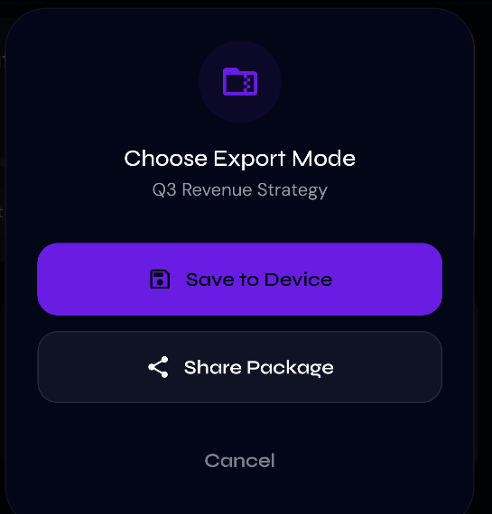
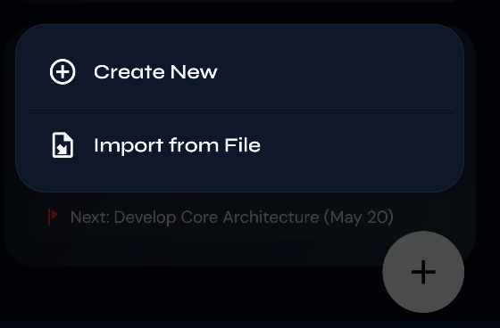
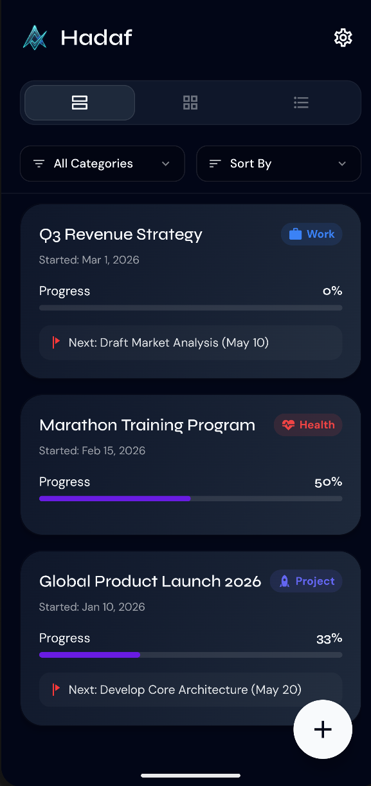
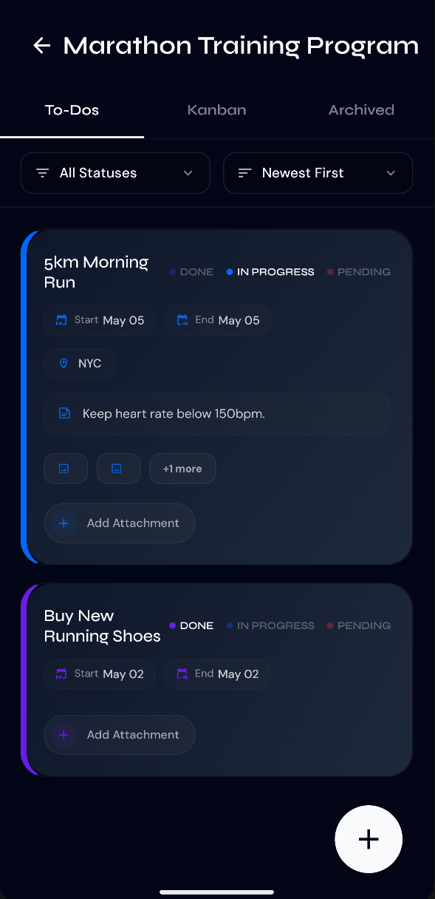
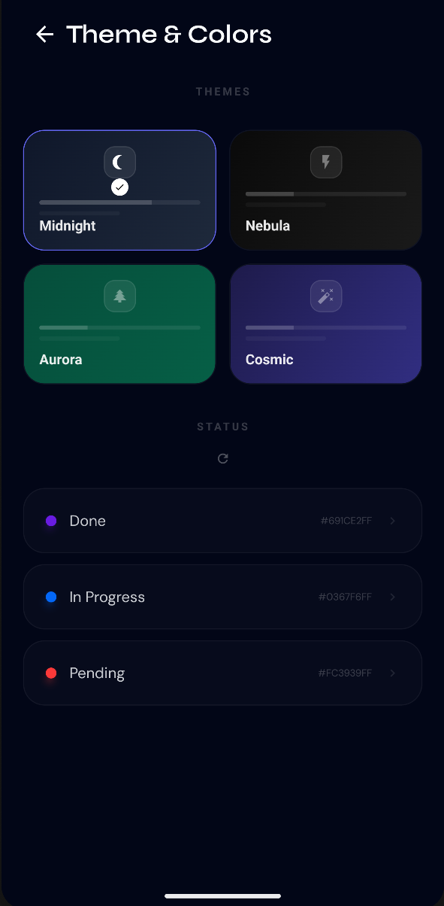
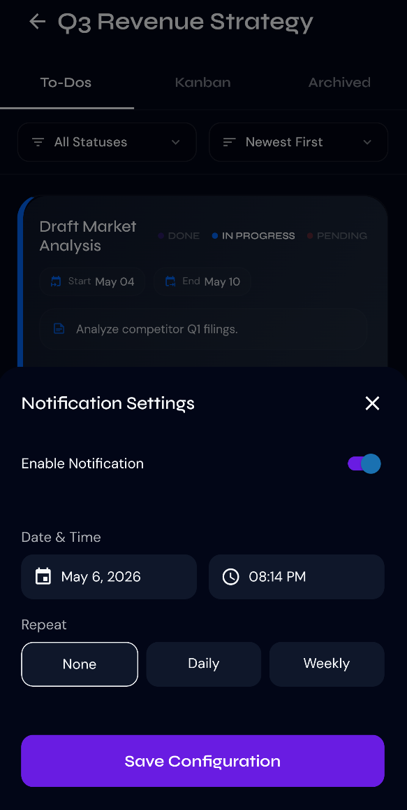

# Hadaf (Target) 🎯 
### The Universal Standard for Goal Achievement & Objective Sharing

Hadaf is a premium, high-contrast productivity ecosystem built to bridge the gap between inspiration and execution. It is designed for those who find standard todo lists too shallow and traditional project managers too clinical.

---

## 🌟 The Vision: A Standard for Sharing Success

Imagine a world where you don't just "read" a guide on how to launch a startup or "watch" a video on a fitness transformation—you **import** it.

Hadaf is building the **Universal Portability Layer for Human Goals**. By allowing users to package complex objectives, tiered tasks, instructions, and physical attachments into a single, portable `.hadaf` (ZIP) format, we are creating a standard where:

*   **Experts** can share precise blueprints for success.
*   **Teams** can sync complex project structures instantly.
*   **Users** can discover and "live" the instructions of others with zero setup time.

**If it's worth doing, it's worth sharing as a Hadaf Objective.**

---

## 📸 Premium Interface Gallery

### 1. The Power of Portability
Hadaf allows you to export your entire objective lifecycle or import others' wisdom with a single tap. Save to your device or share directly across any platform.

| Exporting Blueprints | Importing Wisdom |
| :---: | :---: |
|  |  |

### 2. High-Contrast Execution
Experience your workflow in stunning glassmorphism. Our UI is designed to keep you focused, with status-aware colors and a secondary "frosted glass" layer for sub-details.

| Objectives Dashboard | Kanban Task Flow |
| :---: | :---: |
|  |  |

### 3. Personalize Your Success
From the core status colors to deep cosmic themes, Hadaf adapts to your visual signature.

| Premium Customization | Smart Notification System |
| :---: | :---: |
|  |  |

---

## 🚀 Key Features

*   **Objective Portability:** Export objectives as structured ZIP files containing all data and physical attachments. Share your expertise as a functional file.
*   **Glassmorphism UI:** A state-of-the-art interface featuring semi-transparent layers, dynamic blur effects, and premium typography (`Syne` & `DM Sans`).
*   **Custom Status Ecosystem:** Define your own visual language for `Done`, `In-Progress`, and `Pending` tasks with a 12-color premium palette.
*   **Rich Attachments:** Link documents, images, and files directly to your tasks. Everything is packaged together during export.
*   **Localized Core:** Full support for English (LTR) and Arabic (RTL) with a unified, high-performance design system.
*   **Privacy-First MMKV Storage:** Your data never leaves your device unless you choose to share it.

---

## 📲 Try it Now (Android)

You can experience the premium Hadaf interaction lifecycle immediately by downloading our latest build:

👉 **[Download Hadaf V3 APK](./resources/Hadaf_V3.apk)**

*Note: You may need to enable "Install from Unknown Sources" in your Android settings to install the APK.*

---

## 🛠️ Technology Stack

*   **Framework:** React Native / Expo
*   **State Management:** Zustand (with MMKV Persistence)
*   **Styling:** Custom Theme Engine (Dynamic Runtime Tokens)
*   **Data Layer:** Expo FileSystem & Expo Sharing (Portability Protocol)
*   **Icons:** Material Community Icons

## 👤 Author

**Amer Zuher**
*   [GitHub](https://github.com/AmerZuher)
*   [LinkedIn](https://www.linkedin.com/in/amer-zuher-alriyahi)

## 📄 License

This project is licensed under the MIT License.
