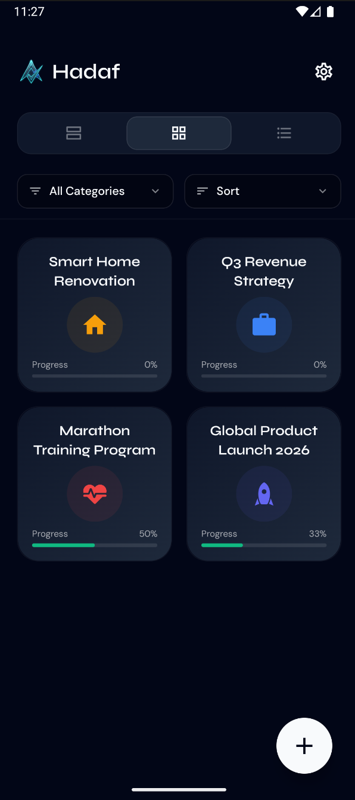
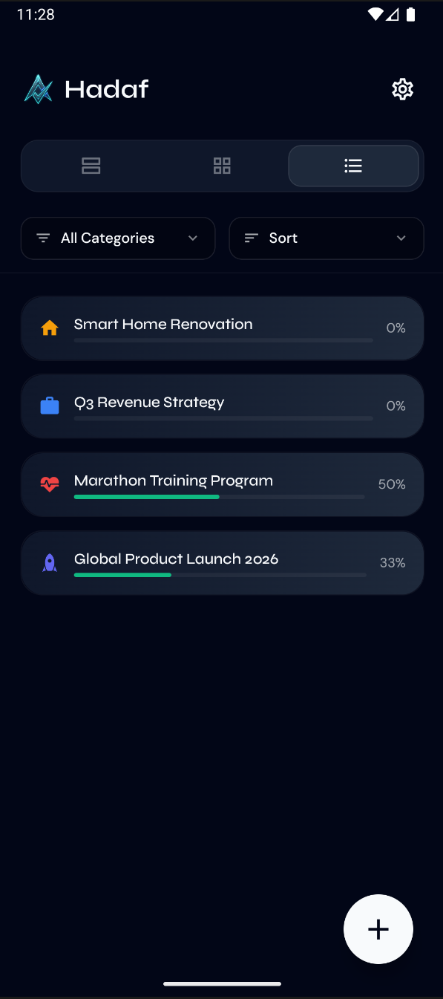

# Hadaf (Target) 🎯

Hadaf is a premium, high-contrast productivity and objective tracking application built with React Native and Expo. It is designed for those who find standard productivity tools too simple and traditional project managers too complex. Hadaf focuses on sleek visuals, essential workflows, and keeping you in the flow state.

---

## 📸 Screen Gallery

### 1. Objectives Dashboard
The heart of Hadaf. View your long-term goals and progress in a clean, high-contrast interface.

<p align="center">
  
</p>

### 2. Grid View Presentation
A visual-first masonry layout for your objectives, perfect for a bird's-eye view of your categories and overall progress.

<p align="center">
  
</p>

### 3. List View Presentation
A streamlined, detail-oriented list of your objectives, focusing on dates and upcoming milestones.

<p align="center">
  
</p>

### 4. Kanban To-Do Management
A professional-grade Kanban board for each objective. Track your tasks through "Pending", "In Progress", and "Done" columns with smooth horizontal scrolling.

<p align="center">
  
</p>

### 5. Premium Themes & Customization
Express your productivity style with built-in high-contrast themes like Cosmic, Nebula, and Aurora. You can also customize status colors (Done, In-Progress, Pending) to match your visual preference.

<p align="center">
  
</p>

---

## 🚀 Features

*   **Dynamic Objectives:** Break down your vision into achievable milestones.
*   **Real Kanban Flow:** Visualize your task pipeline with a functional, status-based board.
*   **Smart Alerts:** Stay on track with precisely timed local notifications for your tasks.
*   **Multiple Presentation Modes:** Toggle between Featured, Grid, or Minimalist modes for your dashboard.
*   **High-Contrast Design:** Experience productivity in high-contrast elegance with curated cosmic color palettes.
*   **Privacy First:** All data is stored locally on your device using high-performance MMKV storage.

---

## ⚡ Quick Demo Setup

To see exactly how Hadaf looks and feels on your mobile device without manually adding data:

1.  **Open Hadaf** on your mobile device (via Expo Go).
2.  Navigate to **Settings** (top right cog icon).
3.  Go to **Backup & Data**.
4.  Tap **Import Data**.
5.  Select the `store/data.json` file from this repository.
6.  **Boom!** Your dashboard will instantly populate with realistic objectives and tasks.

---

## 🛠️ Technology Stack

*   **Framework:** React Native / Expo
*   **State Management:** Zustand
*   **Storage:** react-native-mmkv
*   **Navigation:** Expo Router
*   **Icons:** Material Community Icons

## 📦 Installation

```bash
# Clone the repository
git clone https://github.com/AmerZuher/Hadaf.git

# Install dependencies
npm install

# Start the development server
npx expo start
```

## 👤 Author

**Amer Zuher**
*   [GitHub](https://github.com/AmerZuher)
*   [LinkedIn](https://www.linkedin.com/in/amer-zuher-alriyahi)

## 📄 License

This project is licensed under the MIT License - see the [LICENSE](LICENSE) file for details.
